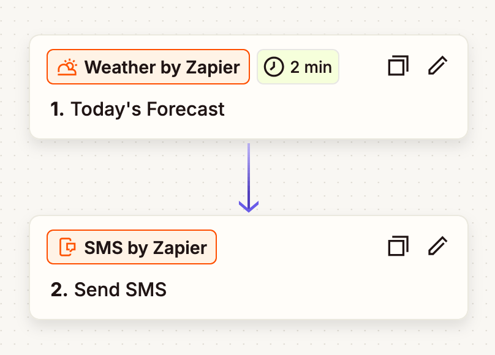
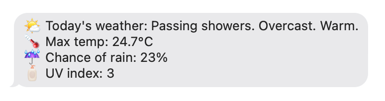
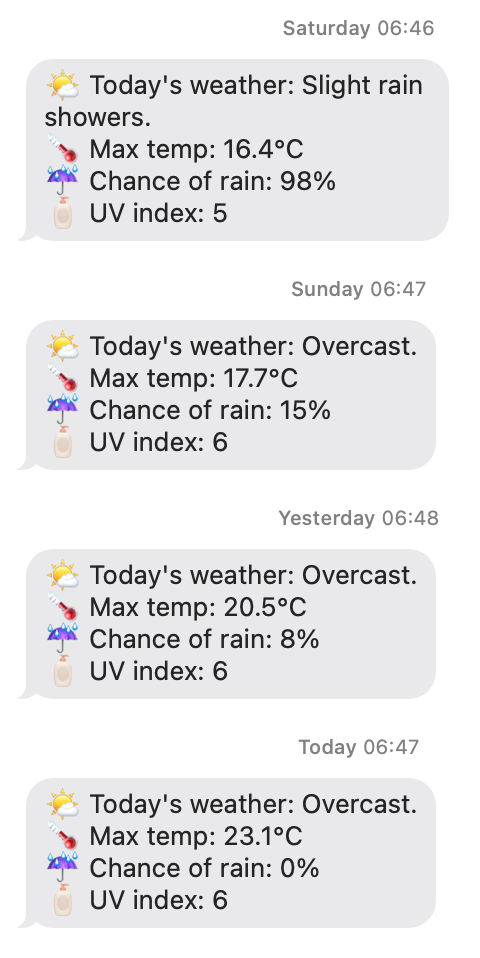

Opening the Weather app every morning is too much effort, but you know what isn't? Writing a recurring job to query an API every morning and send you the results in an SMS, delivered right to your ~~doorstep~~ phone! Come with me as we embark on my short, little journey through this very process.
# Version 1: A Zapier "Zap"
Version 1 of this service was simply just a "zap" on [Zapier](https://zapier.com/app/home). Very easy to connect together a trigger and an action, and start receiving a text message summary every morning at "around 7am".




> *Pretty good already!*

I really like the summary that Zapier generates, as it has a bit more detail that you might get from a single [WMO Weather Code](https://www.nodc.noaa.gov/archive/arc0021/0002199/1.1/data/0-data/HTML/WMO-CODE/WMO4677.HTM).

However I still wanted to actually code this myself, for a couple of reasons:
1. In this very simple version, there's no way to customise what time the message arrives; It's locked at an "around 7am" window. My girlfriend also started using this Zap and her first question to me was whether it could arrive before 7am because she's often leaving for work earlier than that. 
2. This is something I should be able to code and host myself, without relying on a third-party. Maybe just a matter of principle but I felt like, "if I *can* do this myself, I should."
# Version 2: TypeScript + Twilio + GitHub Actions
This was really the sort of thing I wanted to do from the start. Complicated-ish, but with a clear progression and enough moving parts to keep me interested for an afternoon.

- TypeScript + [Open-Meteo](https://open-meteo.com/) SDK for fetching the weather data
- Twilio for sending the SMS (I had to buy another phone number for this!)
- GitHub Actions for setting up a cron job and trigger the send at ~7am every morning
## OpenMeteo
The Open-Meteo service is pretty cool, as it's a free API that combines weather models from multiple different national services (e.g. MetOffice) to provide you with "the most reliable and accurate weather predictions available". The use [flatbuffers](https://github.com/google/flatbuffers) instead of JSON for serialising their API payloads, which is apparently "more efficient" (not quite sure how, but maybe I'll update this once I've found it). It leads to some funky syntax when accessing the data:

```ts
const hourlyWeatherData = {
	temperature2m: hourly.variables(0)!.valuesArray(),
	precipitationProbability: hourly.variables(1).valuesArray(),
	weatherCode: hourly.variables(2)!.valuesArray(),
	uvIndex: hourly.variables(3)!.valuesArray(),
};
```

The SDK provides a way to fetch a single day's-worth of forecast by passing `forecast_days: 1` in the request params, with it returning the max/min value for each field across the course of that day. I actually ended up foregoing this and specifying the exact date-time range instead, though, because it turns out the "daily forecast" was a full 24h time range and I was occasionally seeing results from before I woke up affecting what was being sent (e.g. a 99% chance of rain at 5am would be what's used in the SMS, even if the rest of the day was completely dry). By passing a custom time range (7am to 11pm) and manually grabbing the min/max results myself, I could constraint the weather information to the hours that actually mattered to me.

One improvement I'd like to make to this version is to find a way to generate more detailed summaries. The Zapier version was able to combine information about precipitation, cloud conditions, and temperature into a short, three-sentence summary, whereas my current implementation just uses a single WMO [Weather Code](https://www.nodc.noaa.gov/archive/arc0021/0002199/1.1/data/0-data/HTML/WMO-CODE/WMO4677.HTM), which isn't as detailed. I could probably roll my own, similar version by mapping the maximum temperature and probability of rain to a set of possible strings (e.g. >70% becomes "stormy").
## Twilio
I didn't do a huge amount of shopping around, here. I know people use Twilio for sending text messages, and I needed to send text messages, so I used Twilio. Great job, Twilio Marketing team! 👍

Before fully committing, though, I did some back-of-the-envelope maths to estimate how much this sort of system might cost. Twilio charge £0.89022/month for a phone number, and £0.0463 for every SMS you send from that phone number. Based off the minimum ***£20*** top-up charge to use their service, I reckon I could keep this live for maybe...5 months before I need to top-up? Not too bad for a fun personal project.

The Twilio SDK was actually really easy to set up and use. You basically just pass a string to be used as the message body and tell it which phone number to send from. One slightly annoying thing is there doesn't seem to be a way to send to multiple numbers at once, so you have to wrap this call in a `for` loop if, like me, you're sending to more than one person.

```ts
const client = Twilio(twilioSid, twilioAuthToken);

for (const phoneNumber of phoneNumbers) {
	client.messages.create({
		to: toPhoneNumber,
		from: fromPhoneNumber,
		body: messageBody
	})
}
```

> >The Twilio SDK was actually really easy to set up and use.
>
> I can't say the same about their website, though. It's pretty awful to navigate around and required way too much clicking around to find the billing page and understand where my money's going.

## GitHub Actions
With everything pieced together and working on my machine, I turned to GitHub to provide me with a free, easy way to schedule these text messages and send them out at the same time every day.

Admittedly, I caved here and used Gemini to help me write the Workflow script, because I feel like this is an area where [LLMs are quite helpful](LLMs%20are%20great%20for%20GitHub%20Workflows.md). In a couple of queries I had the script I wanted—or, at least, enough of a script to be able to tinker with and adjust by myself—and could start testing! It's a simple script that runs at 6:45am every morning, scheduled with a cron job.

```yml
name: Send SMS at 6:45am every morning
on:
    schedule:
		- cron: "45 5 * * *" # timezones issue (see below) 🙃
```

> Interestingly, [GitHub Workflows don't support timezones](https://github.com/orgs/community/discussions/13454)! This means that, if I want to sent a text every morning at 7am, when on BST (British Summer Time) I actually need to schedule it for *6am* instead.

*Et voilà!* My work is done and my phone received a text at (roughly) 6:45 every morning!

