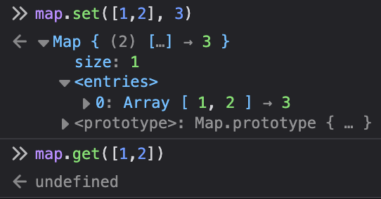

Toilet paper meets Sokoban...sort of. We have to look through all of the rolls of toilet paper on a grid and work out which can be removed, which will be when there are fewer than 4 rolls of toilet paper in the adjacent positions around each roll.

[Read the full prompt.](https://adventofcode.com/2025/day/4)

## Part 1
I didn't really have any clever solution for this. I just iterated through each roll in the grid and counted how many adjacent spaces to it contained a roll, and incremented my answer if that value < 4.

```ts
function partOne() {
	const grid = new Grid(input);

	let answer = 0;

	for (const [pos, val] of grid.points.entries()) {
		if (val !== "@") continue;

		const [y, x] = pos.split(",").map(Number);

		let nearbyRolls = 0;

		for (const dy of [-1, 0, 1]) {
			for (const dx of [-1, 0, 1]) {
				if (dy === 0 && dx === 0) continue;

				if (grid.get(y + dy, x + dx) === "@") {
					nearbyRolls += 1;
				}
			}
		}

		if (nearbyRolls < 4) {
			answer += 1;
		}
	}

	return answer;
}
```

I was able to use my custom [Grid](https://github.com/benslv/aoc/blob/master/2025/utils/Grid.ts) helper from last year, which was nice. All it really does it parse the input into a Map of points that can then be queried. There are some benefits to this, like not running into errors when accessed nested arrays that might be out of bounds—the Grid will just return `undefined` instead. 

It sucks having to format the keys as strings, though. In an ideal world you could use something like a tuple, but JavaScript doesn't have those and you can't use an array as a key because it's added as a reference, which means you can't construct these keys on the fly...something you might want to do if you need to, say, check all of the adjacent points to a coordinate.



## Part 2
I *also* didn't do anything clever for Part 2. I fancied my luck just bruteforcing through to the end and it turned out to be enough, so I was happy to stop there. We can basically just wrap the Part 1 solution in a big ol' `do/while` loop and repeat until there are no rolls left on the grid. It's not very pretty but it's also not very fast!

## Benchmark
```
clk: ~3.01 GHz
cpu: Apple M1 Pro
runtime: node 22.16.0 (arm64-darwin)

benchmark                   avg (min … max) p75 / p99    (min … top 1%)
------------------------------------------- -------------------------------
Part 1                        10.75 ms/iter  10.83 ms       █              
                      (10.10 ms … 12.59 ms)  12.09 ms  ▃   ▂█▇             
                    (  1.76 mb …  11.96 mb)  11.41 mb ▇█▂▄▂███▅▅▁▁▁▂▂▂▂▂▁▂▂

Part 2                       288.44 ms/iter 292.85 ms █   █                
                    (279.43 ms … 307.79 ms) 299.67 ms █▅▅ █▅    ▅  ▅     ▅▅
                    ( 14.39 mb …  14.39 mb)  14.39 mb ███▁██▁▁▁▁█▁▁█▁▁▁▁▁██
```