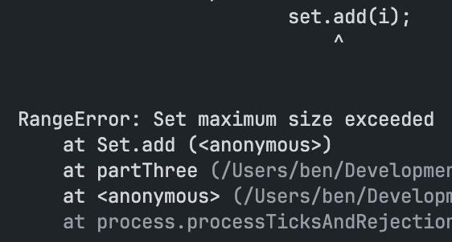
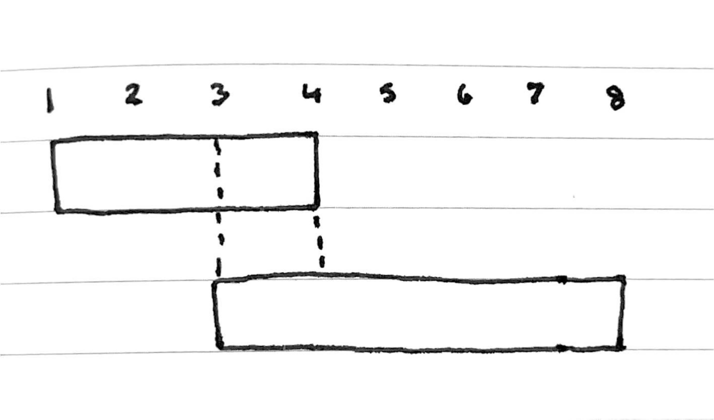

Ingredient management! We need to figure out which ingredients are fresh, and which aren't.

[Read the full prompt.](https://adventofcode.com/2025/day/5)

## Part 1
It's easy enough to write a bruteforce solution for Part 1 and check every ingredient to see if it lies within one of the given ranges of fresh ingredients.

```ts
const freshRanges = ranges.map<Range>(r => { const [lower, upper] = r.split("-").map(Number); return { lower, upper } });

function partOne() {
	let answer = 0;

	for (const ing of ingredients) {
		for (const r of freshRanges) {
			if (Number(ing) >= r.lower && Number(ing) <= r.upper) {
				answer += 1
				break;
			}
		}
	}

	return answer
}
```

## Part 2
Now the challenge shifts slightly: rather than checking which of our ingredients are fresh, we have to look at all of our ranges and work out the total number of ingredients that are considered "fresh".

I also initially tried to bruteforce this and just iterate through each range, adding the ingredients to a set along the way. The idea is that, by the end of the final ingredient range, the set has collected every fresh ingredient exactly once and we can use the size of the set as our answer.

Obviously, it wasn't that simple, though. It turns out that these ranges are quite big and you very quickly exceed the set's maximum size.



Oops...

The approach I went for after this was to sort the ranges in ascending order by their starting value, and then iterate through the list of ranges and increment my final answer by `range.upper - range.lower`. We can use a "pointer" of sorts to keep track of the highest value seen so far, and use it in that calculation to resolve any overlaps.

```ts
function partTwo() {
	let answer = 0;
	let curr = 0;

	for (const range of sortedRanges) {
		let start = Math.max(range.lower, curr + 1);
		answer += Math.max(0, range.upper - start + 1);
		curr = Math.max(curr, range.upper);
	}

	return answer;
}
```


Ooh, a drawing! After counting the first range (1-4) the `curr` pointer will be at 4, so we start from there and calculate `8 - 4` to skip the overlap and count the remaining numbers in the second range.
## Benchmark
Don't you love when Part 2 runs faster than Part 1 🙈

```
clk: ~3.11 GHz
cpu: Apple M1 Pro
runtime: node 20.17.0 (arm64-darwin)

benchmark                   avg (min … max) p75 / p99    (min … top 1%)
------------------------------------------- -------------------------------
Part 1                         8.32 ms/iter   8.35 ms  █                   
                        (8.22 ms … 8.80 ms)   8.68 ms ▃█▃                  
                    (  2.74 mb …   2.74 mb)   2.74 mb ███▅▅▄▃▅▃▃▁▁▂▃▂▃▁▁▁▂▃

Part 2                       249.24 ns/iter 249.21 ns  █                   
                    (246.82 ns … 310.57 ns) 271.93 ns ▆█                   
                    (  4.17  b … 972.03  b)   6.59  b ██▇▄▄▂▂▁▁▁▁▁▁▁▁▁▁▁▁▁▁
```